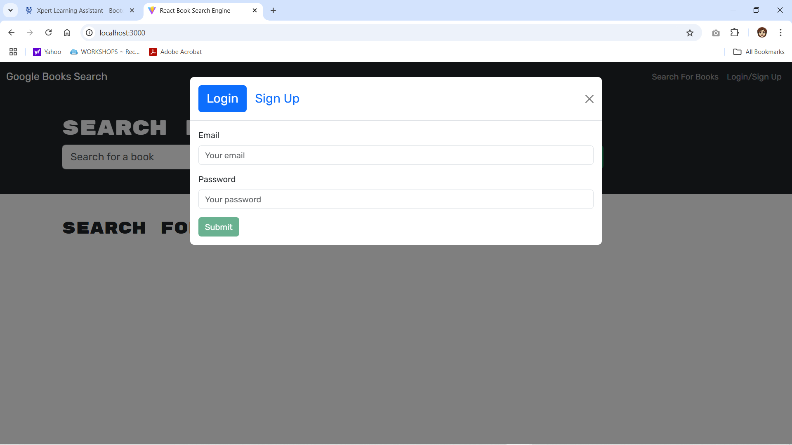
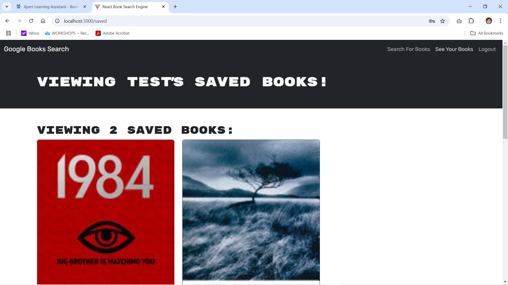
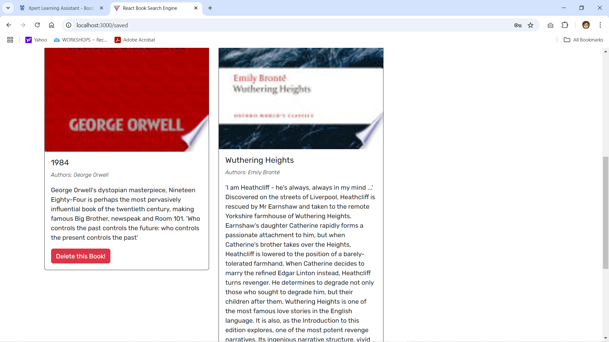

# BookSearchEngine
This is Book Search Engine using the MERN stack. 

# Description

The purpose of this challenge was to take a working Google Books API search engine built with a RESTful API and to refactor it using a GraphQL API built with the Apollo Server.

## Installation

This project is build using Typescript. To run and initiate the app the user should utilize the following:

 * Connection to mongoDB
 * Apollo Server: `npm install apollo-server-express graphql`
 * Apollo Client: `npm install @apollo/client grapgql`
 * Use GraphQL user interface
 
 

## Usage 

Prerequisites: In addition to tools noted abouve, you can install additional dependencies via `npm install`. 

Steps to Interact with the app:

* When user first accesses the app, they see an option to search for books where they can provide input and submit a search. They are then presented with results matching their search. 

* On this page they also can login in or sign up to access the site.

* If the user chooses to Sign Up they can provide required input and select to submit. They are then logged into the site. 

* User can also choose to login with valid credentials set up during the sign up process. 

* When user is authenticated and logged in, they can search for books. 

* User may save books returned in the search results. 

* Authenticated user can also select to "See Saved Books."

* When user opts to "See Saved Books" they see the list of their saved books and also have the option to delete books they have saved. 

## Screenshots

    
## License

This project includes the MIT License.

## Contributions

This project was quite a challenge for me and I received  a great deal of assistance from the Xpert Learning Assistant tool available through my Columbia Engineering Bootcamp account. This tool helped guide me through some difficulties with set up, conditional logic and evaluating code quality. I also was inspired by the code created in the activities in the coursework which helped provide guidance on file and code structure. 

I also received assistance from my tutor for this project (name can be noted once permission is granted) to help evaluate my code and set up the client and server side logic for this project. 

 This repository is available to the public. Please feel free to clone this repository, submit a pull request, and add any issues. You can contact me via GitHub or email!

* [Link to Book Search Engine app repository](https://github.com/shukikat/BookSearchEngine)

* [My Email](mailto:kathuriashuki@gmail.com)

